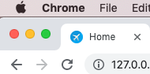
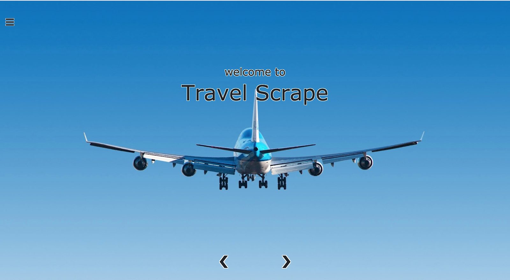

# Django/Python Front End Live Project

Personal Code Summary for the Django team live project I was a part of at Prosper IT Consulting

## Introduction

During my time at The Tech Academy, I was assigned to a two-week sprint working on software to be used as a data scraping travel app.  

My contributions to this Django sprint included tweaks and improvements of the front end styling and functionality.  

Listed below are the stories I worked on, a brief description of their expectations, and the code I created to complete them.

## User Stories

- [Remove Ability To Suspend and Change Role for Self](#remove-ability-to-suspend-and-change-role-for-self)
- [Capture Suspended](#capture-suspended)
- [Separate Users by Type](#separate-users-by-type)
- [Deleting a Job with Attached Objects](#deleting-a-job-with-attached-objects)
- [User List in Dashboard Admin View](#user-list-in-dashboard-admin-view)

### UX and UI Styling To Home Page

1. Change font on home page 
2. Add Favicon to project 
3. Change styling in side nav bar
4. Update background colors
5. Add logout to side nav bar

Original Home Page:

Change Font on Home Page

Goodbye Comic Sans! I also made the image cover the entire screen.

After:

Add Favicon

After:

Change Styling in Side Nav Bar

I also added a Log Out button to the nav bar.

After:

Background Image Scrolling

The user can now scroll the background image to display several differnt backgrounds.

